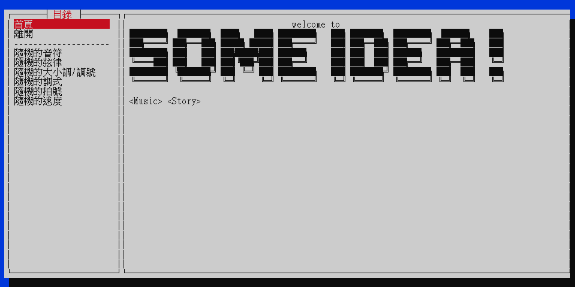

# 💡 SomeIdea

這個終端機小程式可以產生許多隨機元素組合，用於提供簡單的起點，以避免面對空白頁面。

它源自於好和弦的 [**NiceIdea**](https://github.com/wiwikuan/NiceIdea) ，我以 *Rust* 重寫，目前已可用於協助基本的音樂創作，未來也預計將添加[多種新功能](#未來的規劃)。

我撰寫這個程式的主要目的是以此練習 *Rust* 語言。由於不夠熟悉，可能會有許多問題，無論是在程式寫作、功能建議或漏洞與錯誤，都歡迎指教。

### 📜 目錄

- [💡 SomeIdea](#-someidea)
    - [📜 目錄](#-目錄)
    - [🏹 此版本目標](#-此版本目標)
    - [⚖ 與原版比較](#-與原版比較)
        - [．視覺介面](#視覺介面)
        - [．調整修改](#調整修改)
        - [．尺寸迷你](#尺寸迷你)
        - [．平台支援](#平台支援)
        - [．網頁版本](#網頁版本)
    - [⚙ 有哪些功能](#-有哪些功能)
        - [．音樂相關](#音樂相關)
        - [．故事相關](#故事相關)
        - [．外部設定](#外部設定)
    - [🗺 未來的規劃](#-未來的規劃)
    - [💥 已知錯誤表](#-已知錯誤表)
    - [📃 更新日誌表](#-更新日誌表)

----------------------

### 🏹 此版本目標

在 v1.0 中，我只是複製了原始 **NiceIdea** 的功能，並且刪除了「隨機標題」與「隨機想法」兩項。

這是刻意而為，雖然這個專案源自 **NiceIdea** ，目前也確實與原版完全一致，但我並不希望兩者如此相同，終究應有其特色。尤其是這個較偏向個人創意的部份，我不想只是照抄而己。

未來我會嘗試製作類似的功能，令它真正與 **NiceIdea** 區隔開來，不過此刻，它只要能夠順輰運行便算是達到我的期待了。

----------------------

### ⚖ 與原版比較

##### ．視覺介面

此版本在 [**Cursive**](https://github.com/gyscos/Cursive) 庫的輔助下，得以擁有一個不錯的介面，而且，**你可以直接以滑鼠操作**！

##### ．調整修改

**SomeIdea** 由於以 *Rust* 語言撰寫，你可能會發現它比好和弦版的 *JavaScript* 複雜些，較難以自行修改或添加所需功能。我預計在後續版本中添加設定檔的功能，令得以在其中 *定義* 乃至 *重新定義* 大部份產生器。

不過就目前來說，沒有什麼辦法可以提供簡單的自定義方式。

##### ．尺寸迷你

*Rust* 編譯檔比 *JavaScript* 版小了非常多（v1.0 版只有 767KB ，**NiceIdea** *Windows* 版則要 29MB），執行速度也十分快速。

##### ．平台支援

抱歉，由於我只有一臺 *Windows 10* 64 位元電腦，因此無法編譯其它版本，遑論確認其執行狀況。儘管我正在研究如何以 Github Action 交叉編譯不同版本，但短時間內它不會有跨平台支援。

##### ．網頁版本

**SomeIdea** 不會出網頁版喔。至少在現階段，完全沒有這個打算。

----------------------

### ⚙ 有哪些功能

##### ．音樂相關

1. 產生隨機音符
2. 產生隨機和弦
3. 產生隨機大小調、調號
4. 產生隨機調式
5. 產生隨機拍號
6. 產生隨機速度

##### ．故事相關

1. 暫無

##### ．外部設定

1. 暫無

----------------------

### 🗺 未來的規劃

- v1.0+
  
  添加故事寫作類型的產生器，如隨機類型、角色等。
- v2.0

  使其可由外部設定檔或者模組修改產生器功能。
- v2.0+
  
  添加可產生簡單故事文本的功能。

----------------------

### 💥 已知錯誤表

- 雖然當終端機縮放尺寸時，它可以自動適應新的視窗尺寸，但若縮放速度稍快，就很容易崩潰。

  這大概是介面庫的問題，暫時我不會處理它。

----------------------

### 📃 更新日誌表

- 2021/07/04
  
  v1.0 版完成。仿照 NiceIdea 製作了各項功能，以及簡單的介面。
